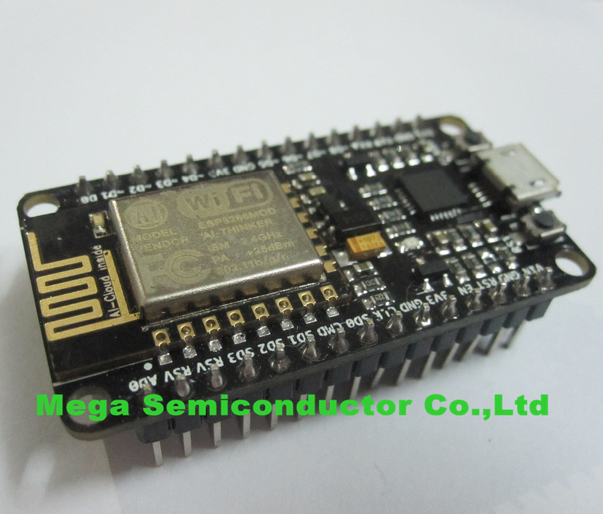
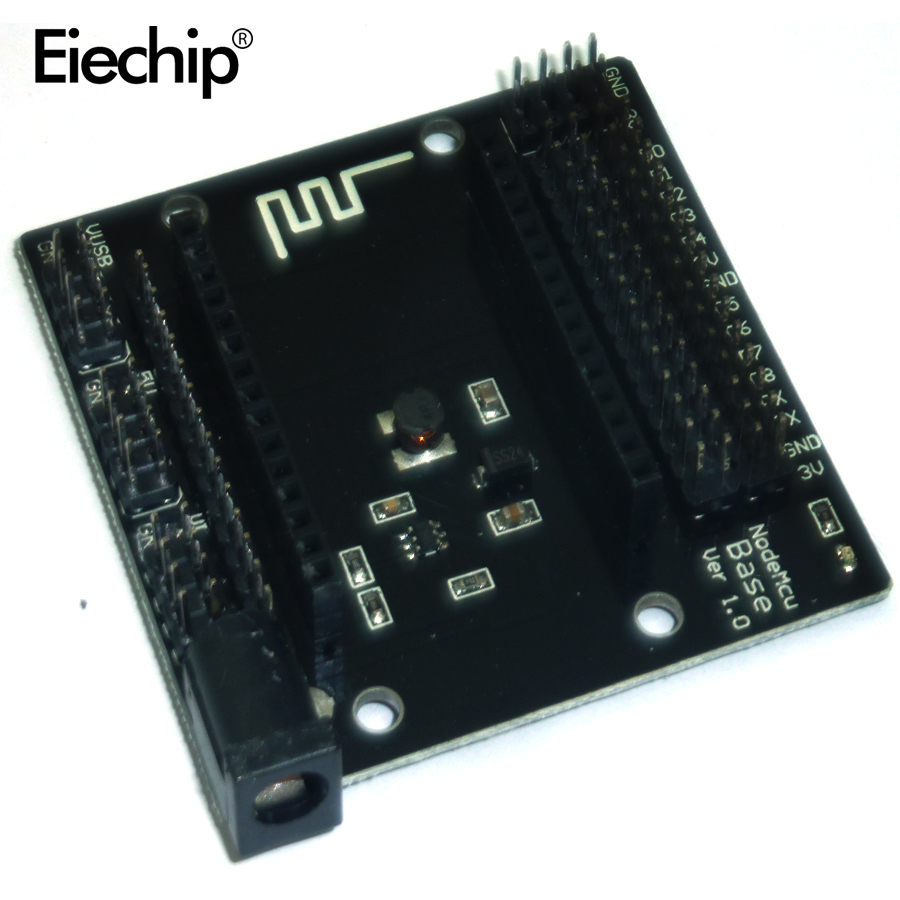
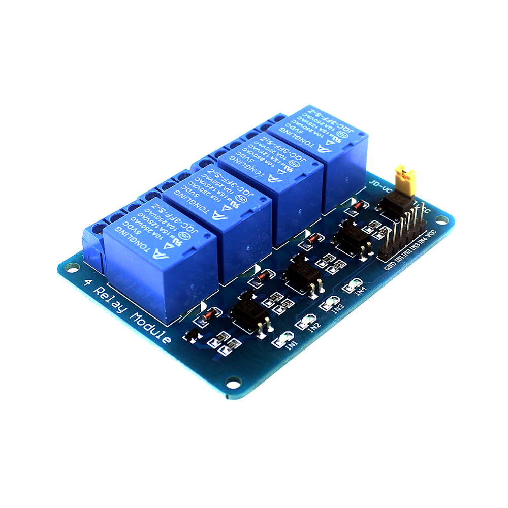
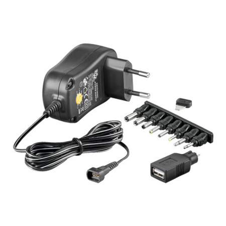

<h1>WiFi переключатель</h1>

<h2>Инструкция по эксплотации</h2>
<pre>
  Подсоединить фазовый провод к синей штучке (слева для включения, справа для выключения) 
провод от нагрузки(лампочки, ворота, насосы, поджиг салюта, ...) подсоединить посередине
если отсоединилось от переключателя в esp8266 то провода идут от gnd->gnd, vcc->5v, in1->d1, in2->d2, in3->d5, in4->d6
воткнуть вилки в розетки
через мобильник подсоединиться к wifi сети "podarok" пароль "????????"
открыть в броузере http://192.168.4.1/
удаленно управлять своим домом
</pre>
<table>
  <tr>
    <td></td>
    <td></td>
  </tr>
</table>
<h2>Детали</h2>
<table>
  <tr>
    <td></td>
    <td>ESP8266 V12 TestBoard 3EUR aliexpress.com </td>
  </tr>
  <tr>
    <td></td>
    <td>ESP8266 Base V1.0 1.5 EUR aliexpress.com</td>
  </tr>
  <tr>
    <td></td>
    <td>5V 4-Channel Relay Module 3EUR aliexpress.com</td>
  </tr>
  <tr>
    <td></td>
    <td>6v Adapter 11Eur www.argus.lv</td>
  </tr>
</table>